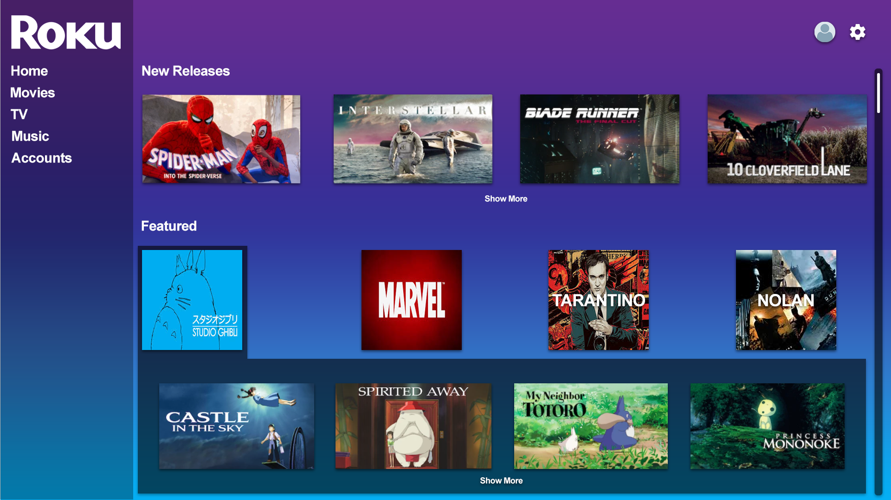

# Authoring 3: Roku Flashback App

# Overview:

A student group project building an app for the Roku streaming service. App will involve both adult and child sections with organized relevant content.

# Development:

html, js, Vue, WAMP, PHP

# Design:

software used: Adobe Photoshop
app mockups can be found in the assets folder as "rokuMockups.pdf"

# Developer Roadmap: 

https://docs.google.com/document/d/13mPrFYhPs_VW9VhEOeh1UtHPPOEXVm2HXjEN8QJvQqs/edit?usp=sharing

# Designer Roadmap:

https://docs.google.com/document/d/1N5G2pjN472xMC7aj7HWQKual03sADsc9lZaVp9SuZkE/edit?usp=sharing

# Contributions:

Nic Amerongen - Developer (p1)
Greg Avery - Designer